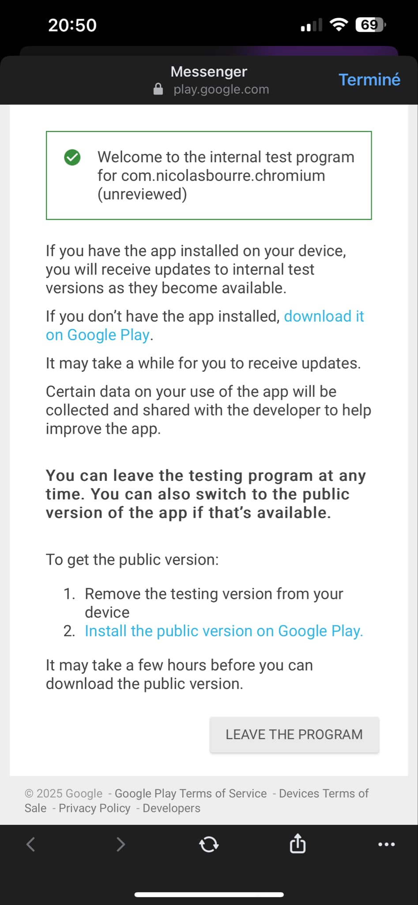
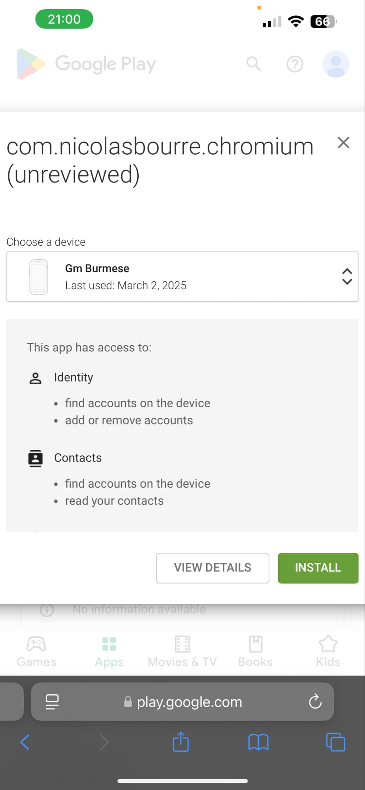
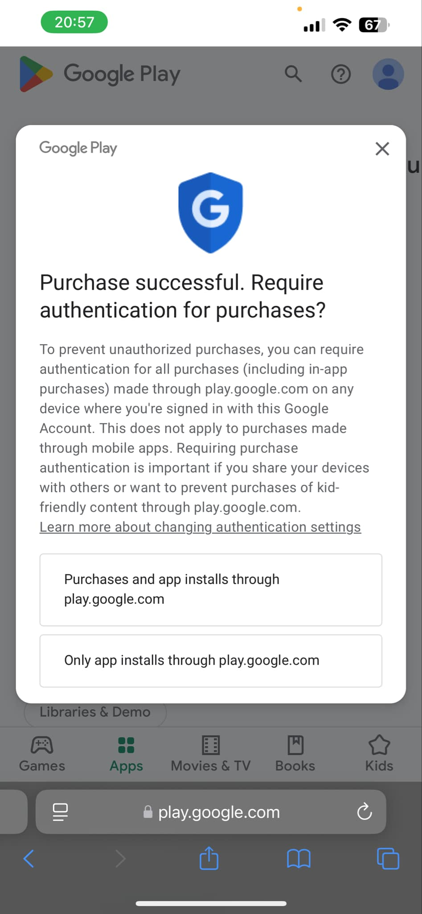
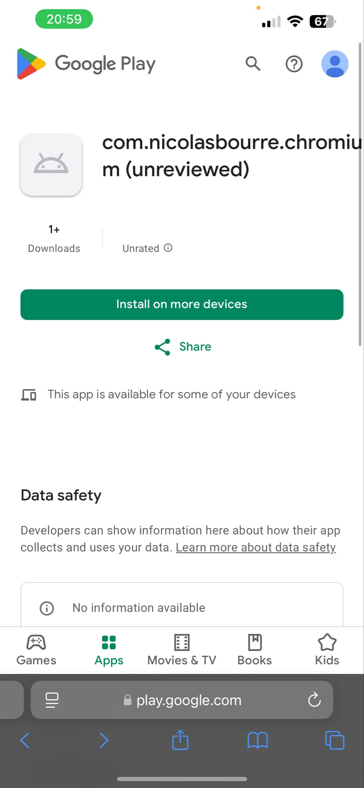
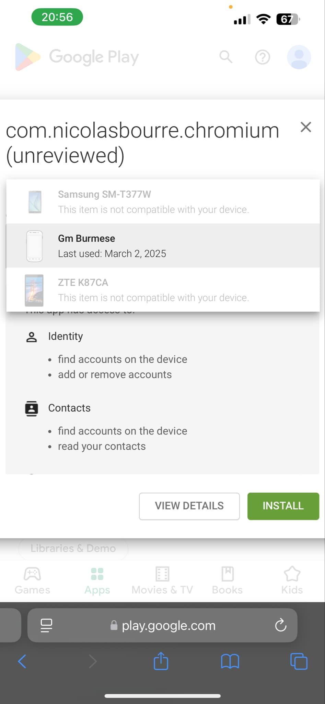

# Installation instructions

## Setup from iPhone
- Open the link in Safari
- Connect to Play Store with the account used in your car

- Click "Join the beta" or something similar
- Select "GM Burmese"

- Click "Install"

- Since you're an iPhone guy, if it's the first time you use Google Play, you might have a screen like this. Select "Purchases and app installs through play.google.com"

- If you have the following screen, select "Install on more devices"

- Select "Gm Burmese" and click "Install"

