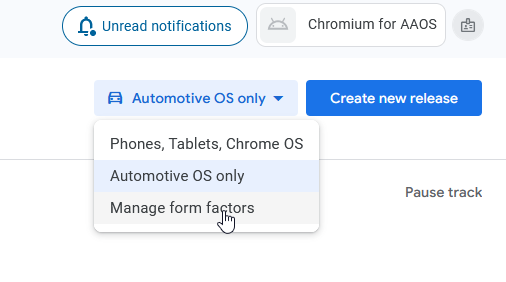

This repo has a patch to enable chromium to be ran on android automotive, along with scripts to help ease the build process.

# Warning 🫷
Compiling this under WSL on a mounted Windows drive, like I did, **will take forever (24h! In my case)**. I recommend using a linux machine or a VM or directly on WSL main drive such as the `home` folder.

# Android Setup

```
cd ~/
git clone https://github.com/zunichky/chromium_aaos.git chromium
cd chromium
```

- Follow the offical [google chromium guide](https://chromium.googlesource.com/chromium/src/+/main/docs/android_build_instructions.md) down to "Setting up the build".
- When you get to "Setting up the build", run ```gn gen out/Release_arm64``` and copy the contents of [Release_arm64.gn](/Release_arm64.gn).  
- To build you could continue to use the offical guide but these instructions going forward will use custom build scripts. It is helpful to still have the chromium guide pulled up while running through this readme.

# Building

## Create a keystore

You must create a keystore to sign the app before building. You can create a keystore using the following command.

```
keytool -genkeypair -v   -keystore ~/Documents/KeyStore/store.jks   -alias android_app
  -keyalg RSA   -keysize 2048   -validity 10000
```

- **Note :** The folder must exist before running the command. In the above example, the folder is `~/Documents/KeyStore/`.

## Dependencies
The following folder structure exists  
```
|$HOME
|  |--chromium
|       pull_latest.sh
|       etc.   
|     |--src  
|  |--Android (See note below)
|     |--Sdk  
|        |--build-tools  
|  |--Documents
|     |--KeyStore
|          store.jks
```

> **Note:** You might have some tools already installed like `apksigner`. To verify, run `apksigner --version`. If not installed, you can install the `Android build tools` with the following command:`sudo apt -y install android-sdk-build-tools`
> 
> Then you won't need the `Android` folder in your home directory.

`apksigner` is needed for the signing of the `aab` with the keystore. 


## Apply automotive path to source
Run ```./pull_latest.sh```. This will:  
1. Fetch the latest chromium code
2. Apply a patch to make the app "AAOS compatible"
3. runhooks  

## Building for target

### Making a release
Run ```./build_release.sh```. This proces will take hours to complete. This will:
1. Setup parameters based on target architecture
2. Find latest version file, and bump the major by 1
3. Run build command to build an app bundle (.aab)
4. Sign the .aab output file (needed to upload to Play Store) - Will ask to enter password which was used to create the keystore  
Output: ```$HOME/chromium/src/out/Release_arm64/apks/MonochromePublic6432.aab```

## Building for emulator
**TODO**  
```./build_apk.sh ```

## Uploading to Play Store
**TODO**  
1. Create dev account (25 USD)
2. Go to [Google Play Console](https://play.google.com/console)
3. Create a new app
4. Add Automotive OS only form factor
    - In my case, I have already created a form factor for Automotive OS.
    - If you have never done this before, click on "Manage form factors".
    
    - Click on "Add form factor" and select "Automotive OS".
5. Publish app to internal testing
6. Add privacy statement
7. Add testers emails
8. Go to the "Copy link" URL and install the app to your target device